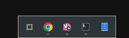

# simple.dock

A minimal, autohiding app dock for [Omarchy](https://omarchy.org) (Quickshell).



## Features

- Centered dock card opposite the bar (default: bottom edge).
- Apps menu button that opens the Omarchy apps menu.
- Pinned apps (in your chosen order) followed by running apps.
- Left-click a running app to focus it (or launch a pinned app that isn't running).
- Right-click for a context menu: **Launch**, **Pin to Dock** / **Unpin from Dock**, and **Close Window(s)**.
- Pin state persists in `~/.config/omarchy/dock.json` across shell restarts.
- Autohide: the dock hides and reveals itself when the cursor touches the
  bottom edge of the screen. Disable it via `~/.config/omarchy/simple.dock.json`
  (`"autohide": false`) to keep the dock pinned.

## Requirements

- An Omarchy system (omarchy-shell with Quickshell support).

## Installation

Install and enable with the official Omarchy plugin command:

```sh
omarchy plugin add https://github.com/nightdevil00/simple.dock.git --enable
```

The command clones the repo into `~/.config/omarchy/plugins/simple.dock`,
validates the manifest, and enables the plugin. To update it later:

```sh
omarchy plugin update simple.dock
```

To uninstall:

```sh
omarchy plugin remove simple.dock
```

After installing (or removing) the plugin, the shell restarts or rescans the
plugin directory automatically; if the dock does not appear, run
`omarchy restart shell`.

The dock appears at the bottom of the primary monitor. Touch the bottom edge
of the screen with the cursor to reveal it.

## Configuration

### Pinned apps

Pinned apps are stored in `~/.config/omarchy/dock.json`:

```json
{
  "pinned": ["vesktop", "foot", "org.gnome.Nautilus"]
}
```

Entries are desktop-file ids (the `.desktop` suffix is optional). The file is
created automatically the first time you pin an app; edits you make to it are
picked up while the shell is running.

### Autohide

The dock hides and reveals itself when the cursor touches the bottom edge of
the screen. To keep it pinned and always visible, create
`~/.config/omarchy/simple.dock.json` with:

```json
{
  "autohide": false
}
```

The file is optional — a missing file (or `"autohide": true`) enables
autohide. Edits are picked up live, no restart needed.

## Files

- `manifest.json` — plugin manifest (`id: simple.dock`, `kind: overlay`, kept loaded).
- `Dock.qml` — the dock UI (a full-screen overlay whose interactive region is
  limited to the dock card, the context menu, and the bottom reveal strip).
- `DockModel.js` — pure helpers for the model and persistence.

## License

MIT
